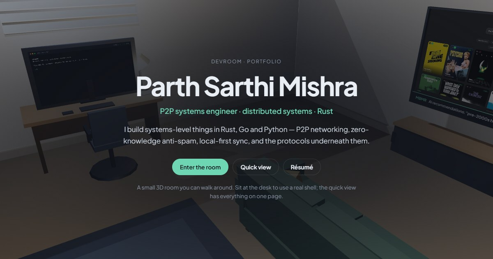

<a href="https://mrsarthi.github.io/mrsarthi/">
  
</a>

# Parth Sarthi Mishra

**Backend engineer, building toward Web3.** I build systems-level things in Rust, Go and Python: P2P networking, zero-knowledge anti-spam, local-first sync, and the protocols underneath them.

My portfolio is a [3D room you can walk around](https://mrsarthi.github.io/mrsarthi/), with a real shell at the desk.

## One system, four repos

```
┌─────────────┬──────────┬──────────────────────────────────────────┐
│ EchoIt      │ app      │ E2E encrypted messenger. No account,     │
│             │          │ no server holding your history.          │
├─────────────┼──────────┼──────────────────────────────────────────┤
│ Dicsussion  │ protocol │ P2P over QUIC. ZK-RLN proofs rate-limit  │
│             │          │ spam without revealing who sent it.      │
├─────────────┼──────────┼──────────────────────────────────────────┤
│ Corroborate │ sync     │ CRDT state that converges after dropped, │
│             │          │ delayed and reordered messages.          │
├─────────────┼──────────┼──────────────────────────────────────────┤
│ Chorrent    │ transfer │ File swarm in Rust. Every 64 KiB piece   │
│             │          │ checked against a BLAKE3 Merkle root.    │
└─────────────┴──────────┴──────────────────────────────────────────┘
```

| Project | Proof it's real |
| --- | --- |
| [EchoIt](https://mrsarthi.github.io/EchoIt-Messenger/) | v0.4.0 beta, signed Windows + Android [builds](https://github.com/mrsarthi/EchoIt-Messenger/releases/latest) |
| [Dicsussion](https://github.com/mrsarthi/DicsussionProtocol) | v0.8.1, 552 Playwright tests, 4 RFCs, [6-party trusted setup](https://github.com/mrsarthi/Ceremonial-Contributions) |
| [Corroborate](https://github.com/mrsarthi/Corroborate) | in progress |
| [Chorrent](https://github.com/mrsarthi/Chorrent) | v0.2.0, verified byte-for-byte between two devices 900+ km apart |

## Side quests

- [**MBMR**](https://github.com/mrsarthi/MBM_recommender) ([live](https://mbm-recommender-nine.vercel.app/)): mood-based movie picks, trained on my Letterboxd diary
- [**MACCO**](https://github.com/mrsarthi/MACCO): multi-agent code Q&A where every claim must cite a real line of code
- [**G.I.D.E.O.N**](https://github.com/mrsarthi/G.I.D.E.O.N): a local-first AI assistant with a 3D hologram
- [**CodeFit**](https://github.com/wforShubham/CodeFit/pulls?q=is%3Apr+author%3Amrsarthi): 6 merged PRs, including Judge0 code execution over WebSockets

---

<p align="center">
  <a href="https://mrsarthi.github.io/mrsarthi/">Portfolio</a> ·
  <a href="https://www.linkedin.com/in/parth-sarthi-mishra-5587b8210/">LinkedIn</a> ·
  <a href="https://codeforces.com/profile/sarth_parthi">Codeforces</a> ·
  <a href="https://leetcode.com/u/sarth_parthi/">LeetCode</a> ·
  <a href="mailto:wforsarthi@gmail.com">wforsarthi@gmail.com</a>
</p>
